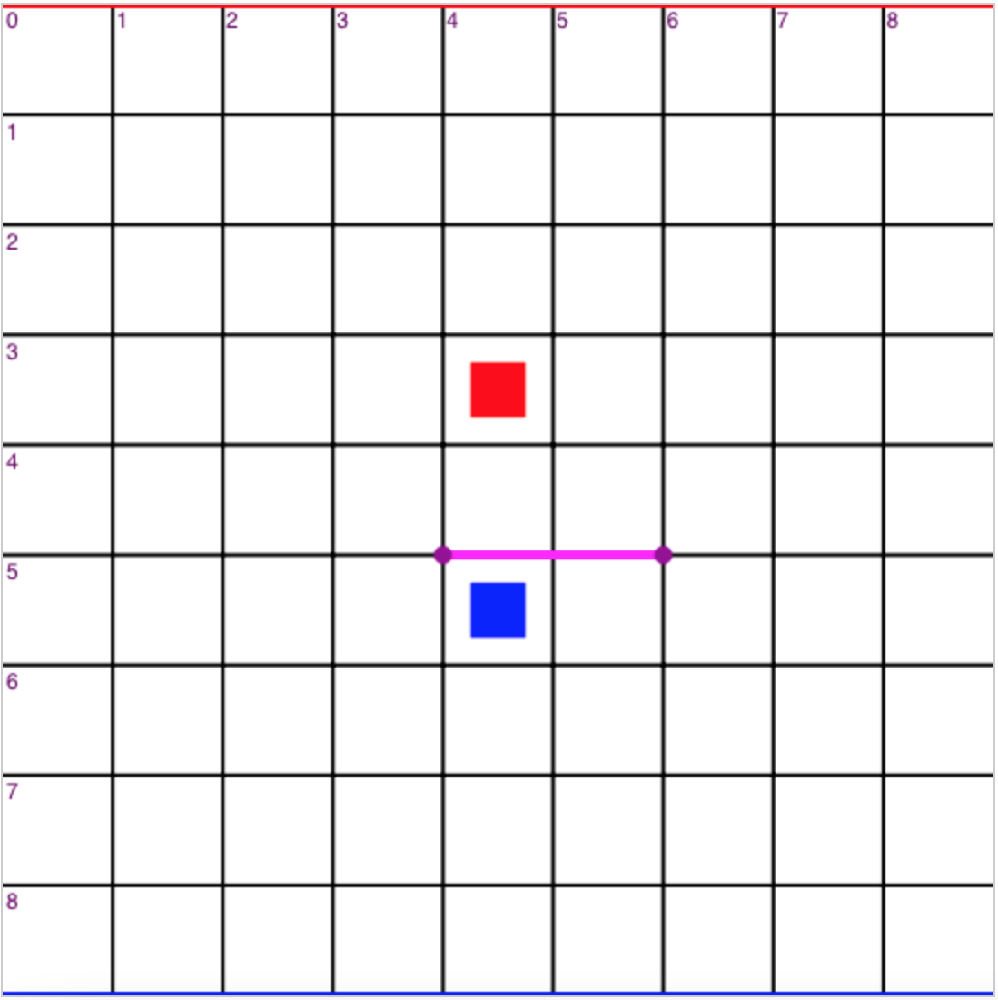
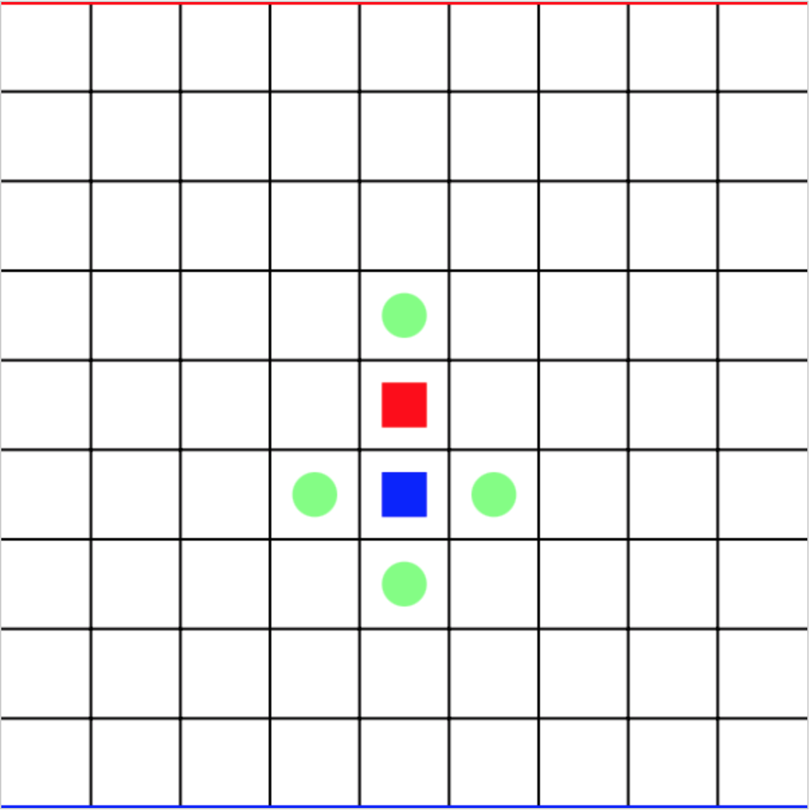
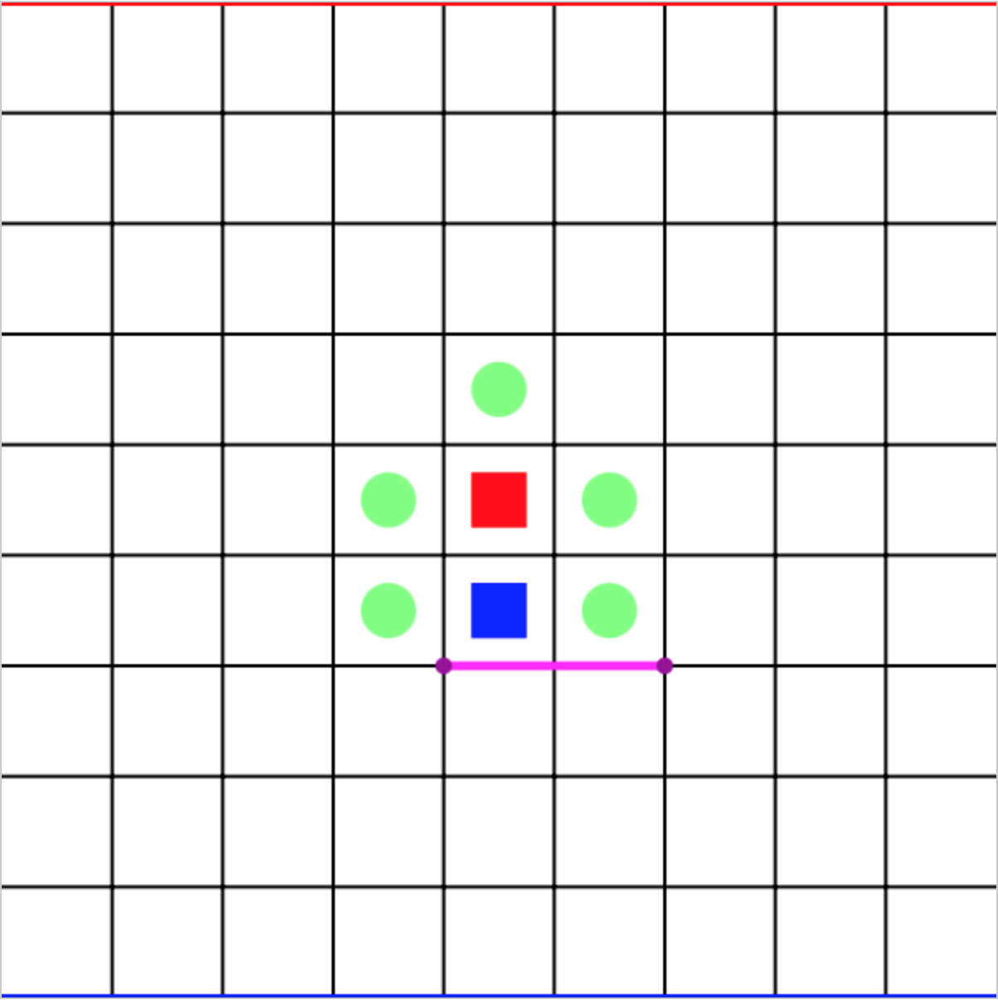
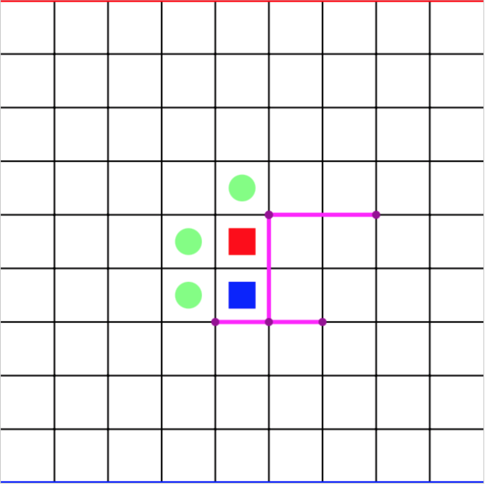
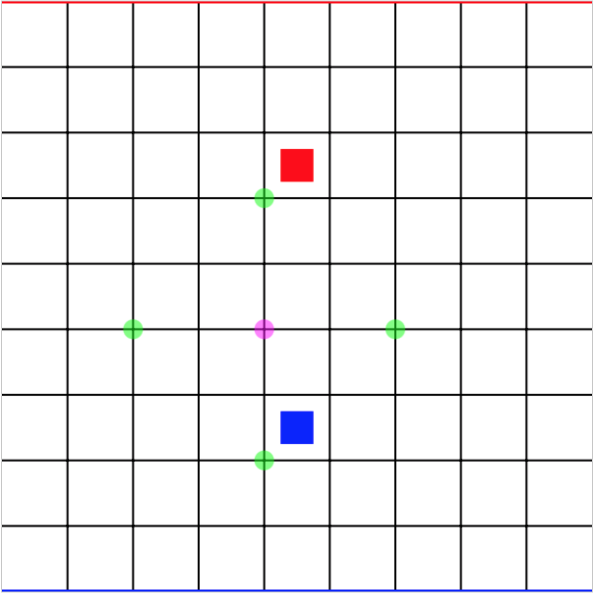
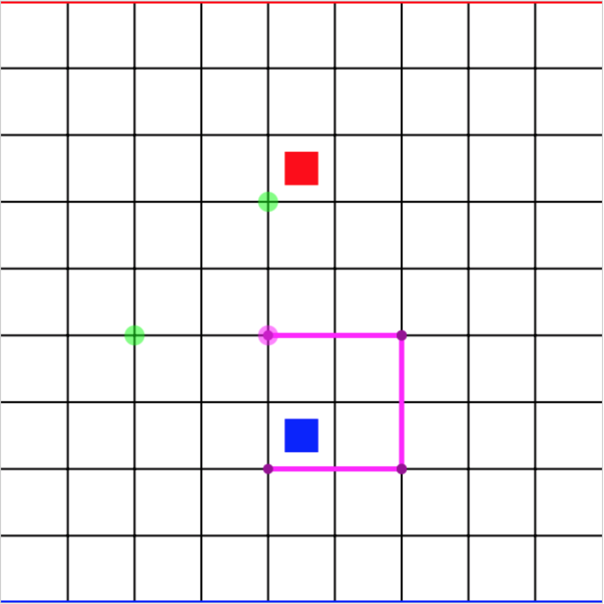

<style>
    img {
        display: block;
        max-width: 500px !important;
    }
</style>
# Quoridor Handbook v1

## 1. Basic Rules
Quoridor is a strategy game with 2 players.
The goal of the game is to move your <b>avatar</b> (represented by a colored square in the game play) to the <b>baseline</b> (represented by a colored line identical with his color) of your opponent.

During this process, your opponent can place <b>boards</b> (represented by a purple line with both sides marked) to hinder you from doing this, and you can also place boards to hinder him.

You cannot, however, completely <b>block</b> your opponent from reaching your baseline.
Instead, you must leave him at least one possible route, but the length of that route is arbitrary.

## 2. Game Grid
The valid area of this game is a 9&times;9 plate.

Avatars must stay <b>in the grid boxes</b>, that is, surrounded by lines inside the grid.

Boards must be placed <b>on the grid lines</b> to behave like a wall. Both ends of the board must fall on grid points.

The most top-left point of the grid is given the coordinates of (0,0).
X-axis is horizontal, Y-axis is vertical, assigning all points coordinates from (0,0) to (9,9).
The coordinates of a grid box is the coordinates of its top-left point.

For example, in Figure 1 shown below, the red avatar is in box (4,3), the blue avatar (4,5).
The board is from grid point (4,5) to (6,5).

Figure 1: Coordinates System


## 3. Game Process

When a game begins, the red avatar (of player1) is at box (4,0), while the blue avatar (of player2) is at box (4,8).

In each player's turn, the player has to take exactly one of the following actions:

- <b>Move</b>. You can move your avatar from its current box to a box next to it if no boards prevent you from doing this, e.g. from (5,6) to (5,7).

- <b>Jump</b>. Jumping is a special kind of moving. If your opponent is next to you with no boards in between, you can jump over your opponent.
In normal cases, you can only jump straight over, but if there is a board over your opponent or the box you are jumping to is outside the grid,
you can jump to either sides of your opponent (if no boards are blocking you).

Figure 2: Normal Jump (player2 from (4,5) to (4,3))


Figure 3: Alternative Jump (player1 from (4,4) to (5,3) / (5,5))


Figure 4: Alternative Jump (Blocked) (player1 from (4,4) to (5,3))


As shown in the above image, move and jump choices are displayed in green circles. 
Click on the avatar to display these choices, and click on the circles to make the move.
Clicking elsewhere will cancel the move.

- <b>Place a board</b>. Places a board of length 2.
Boards must not intersect with each other, but crossing another board's end is allowed.
As described in Section 1, you cannot completely block your opponent from reaching your baseline (unless they've surrendered).

Figure 5: Board Choices


Figure 6: Board Choices (cannot place board from (4,5) to (4,7) as this board seals player2)


To display board choices, click on a grid point. To place a board, click on the green circles.
Clicking elsewhere will cancel the board placement.
You cannot place boards on the grid borders (e.g. from (0,0) to (0,2)).

By default, every player has 10 boards, but this is configurable.
After you run out of boards, you cannot place any boards.

- <b>Surrender</b>. If you see no hope in winning, you can claim your opponent as winner.
Click the "Surrender" button to declare your failure.

The above actions are repeated in turn, until one of the players reaches its destination or surrenders.

## 4. Extension Rules

### 4.1 Four Player Mode

Quoridor can also be played with 4 participants.
Similar to standard mode, players must move to their opposite baselines.

Changed rules in 4 player mode:

- The grid is extended to 11&times;11.
When the game begins, all players are located in the middle of their baselines.

- Everyone has 7 boards by default. Still, board count is configurable.

- The game won't end until 3 players have finished their game (that is, winned or surrendered).
When a player finished his game, his avatar will be frozen to its current box and excluded from route judgment (you don't have to leave him a route).
Other avatars can jump over him.

- If a player blocks you from jumping, than you can jump over him, too.
e.g. If you are in (5,1), and other players (5,2), (5,3), (5,4), than you can directly jump to (5,5) in one step.

### 4.2 Timer

Timers are globally enabled in provided game presets and are set to 20 seconds.
Timer availablility and value is configurable.

If the timer elapsed and you still haven't finished your current step, one of three punishments below will be executed:

- <b>+1 Board for your opponent (2 player mode only)</b>. Your opponent will receive an additional board.

- <b>+1 Cheat for your opponent (2 player &amp; cheatable mode only)</b>. Your opponent will receive an additional cheat.

- <b>Surrender</b>. Lose the game.

The timer will not reset until next step, which means the punishment can only be executed once per step.

### 4.3 Cheatable Mode

The quoridor game itself is rather boring, so we (I) developed this mode to increase playablility.

By default, each player has 1 opportunity to cheat, but this is configurable.
In one player's turn, he can choose to cheat by clicking the "Cheat" button.
In the cheat list, he can select one of the following actions:

- <b>Additional round</b>. You can play 2 rounds (moving or placing boards) subsequently.

- <b>Additional board</b>. Receive an extra board.

- <b>Short board</b>. The next board you place will be of length 1.
If you use this cheat, you can only place board in this round.

- <b>Long board</b>. The next board you place will be of length 3.
If you use this cheat, you can only place board in this round.

- <b>Destroyer</b>. You can invalidate a nearby board.
The board will hold its place (prevent board placement) as any normal boards, but you (and other players) can move through it.
The destroying process consumes one step, so you cannot go through the board in the current round.

If you wins without cheating, you will get a "True Victory" sign in the results dialog.
If you wins by cheating, you will get a "Cheater, though".

## 5. Additional Features

### 5.1 Replays

You can save your game replay by clicking the "Save Replay" button in the results dialog and specifying a name.

In the lobby, you can find your replay in the "Game Replays" section.

In the replay, every step is represented using the QRA (Quoridor Replay Actions) format, that is:
```
!<action> [<parameter> ...]
```

For example,
```
!board (3,4) V 2
```

Means placing a vertical board starting from (3,4) of length 2 ((3,4) to (3,6)). And,
```
!cheat:destroyer (5,6) H
```

Means destroying a horizontal board starting from (5,6).

You can also directly read the replay data located in the
`[app-folder]/.quoridor/replays`
folder. Each replay's file name is identical to its id shown in the lobby, with a .cbor extension.

Replay data is serialized using the CBOR (Concise Binary Object Representation) format as defined in RFC 8949.
Before serialization, each replay action is encoded into an array of numbers or points, as:

```
[2, [4, 5], 0, 2]
```

Means board placement (2), at (4,5), horizontal (0), length 2.

Find out more by reading the source code at gitee (https://gitee.com/origamizyt/quoridor).